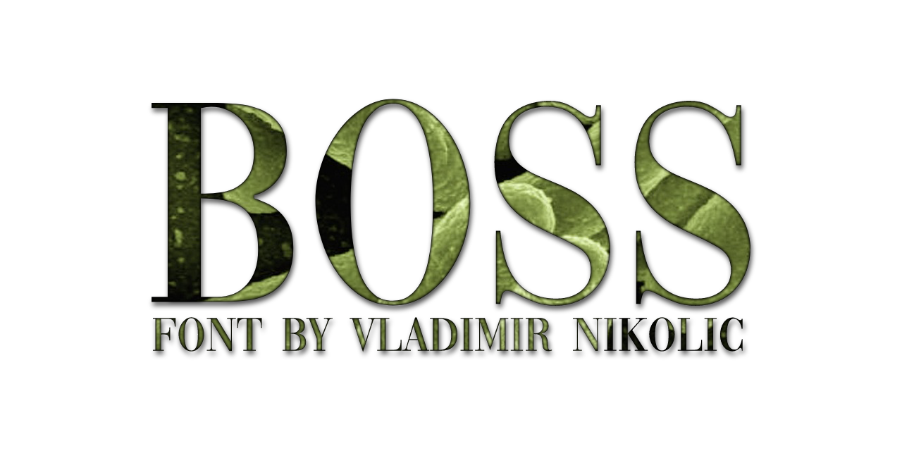

# Boss
add Boss

Boss is a person who is in charge of a worker, group, or organization.

## Variable Font Axe

Boss has the following axe:

  Tag | Default | Static Instances
--- | --- | ---
  wght | 400 | Regular

## License
This Font Software is licensed under the SIL Open Font License, Version 1.1.
This license is available with a FAQ at [https://openfontlicense.org](https://openfontlicense.org)
